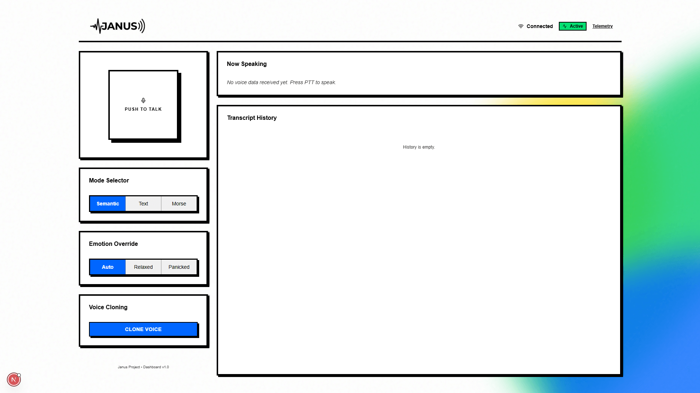
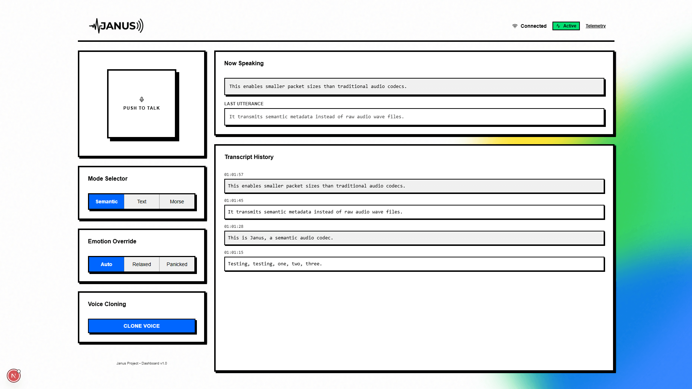
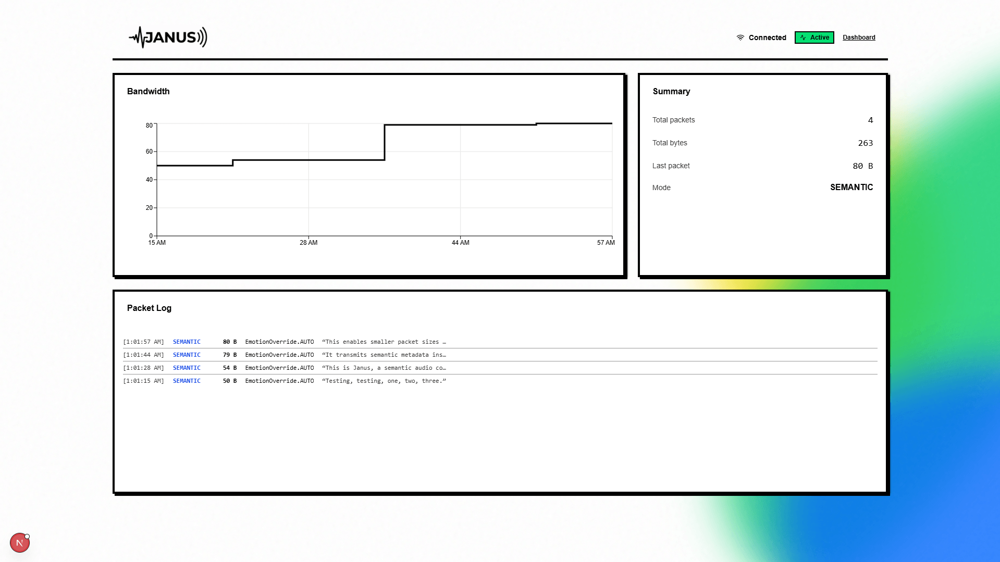

  

Janus is a real-time semantic audio codec system designed to optimize bandwidth by transmitting semantic meaning rather than raw audio waveforms. Instead of sending compressed audio data, Janus converts speech to text, extracts prosodic metadata (pitch and energy), and reconstructs the voice on the receiver side using generative text-to-speech synthesis. This approach enables high-quality voice communication over extremely constrained network connections (as low as 300bps), where it is reconstructed into natural-sounding speech using modern generative TTS models.

### Research Inspiration

Janus is an implementation of concepts introduced in **[SemantiCodec (Liu et al., 2024)](https://arxiv.org/abs/2405.00233)**, a state-of-the-art semantic codec that demonstrated the viability of sub-kbps speech transmission. While the original paper focuses on diffusion-based reconstruction, Janus adapts this for real-time latency by substituting the diffusion decoder with a faster LLM-based instruction pipeline. 

### How Janus Works
Janus extends into a real-time system by leveraging an end-to-end STT → semantic-packet → TTS pipeline:
1. **STT Layer (Faster-Whisper)**
2. **Prosody Layer (Aubio)**
   Captures pitch and energy to preserve vocal tone.
3. **Compression Layer (MessagePack)**
   Packages text and prosody into ~300 bps payloads.
4. **Reconstruction Layer (FishAudio TTS)**
   Generates natural speech using the received semantic instructions.

  

  
<b>View Dashboard</b>

   

| Blank Dashboard | Active Dashboard |
| :---: | :---: |
|  |  |

## Impact

Traditional codecs bind audio quality to bandwidth: less data means worse sound. Janus sidesteps this by transmitting text and prosody instructions instead of audio. This allows for crystal-clear voice reconstruction at 300bps, regardless of network conditions.

  
<b>View Telemetry</b>

  

    
  

### Performance

- **Operating Bitrate**: 300 bits per second (bps)
- **Comparison to VoIP**: ~20x more efficient than standard VoIP codecs like Opus (which requires minimum ~6 kbps for robust operation)
- **Comparison to SOTA Codecs**: 5-10x more efficient than state-of-the-art neural waveform codecs (Lyra/EnCodec, which reach a physical compression floor at ~1.5-3 kbps)

### Cost Savings

**Pricing Comparison:** Janus achieves a 158x cost reduction for critical satellite communication
- **Standard Satellite Voice** (Iridium Land): ~$0.89 per minute
- **Janus Semantic Voice** (Iridium Certus Data): ~$0.0056 per event

**Operational Impact:** For industrial users operating remote fleets, this nearly eliminates vocal communication expenses
- **Standard Voice OPEX**: $13,350/month for a single fleet
- **Semantic Voice OPEX**: $84/month for the same fleet

### Applications

**Public Safety and Disaster Relief**
- Reliable communication when infrastructure fails during mass casualty events (Maui wildfires, Hurricane Helene)
- Crystal-clear synthesized audio reduces cognitive load on first responders

**Global South and Rural Connectivity**
- Voice over ultra-low-power networks (LoRaWAN, LPWAN) where high-bandwidth is unviable
- Addresses digital divide in underserved regions

**Maritime Communications**
- Primary/backup voice over expensive L-band satellites (Iridium/Inmarsat)
- Eliminates economic friction discouraging detailed voice exchanges at sea

**Smart Mining Operations**
- Coordinates supervisors in remote surface operations
- Maintains communication in subterranean GPS-denied environments

**Low-Power/Off-Grid IoT**
- Voice commands on battery-powered devices and sensor networks
- Complies with strict regulatory duty cycle limits (1% Europe) impossible for continuous voice

## Documentation

- **[SETUP.md](docs/SETUP.md)**: Environment setup, installation, and start instructions
- **[ARCHITECTURE.md](docs/ARCHITECTURE.md)**: Architecture, tech stack, and design decisions
- **[API.md](docs/API.md)**: WebSocket and REST API reference
- **[TESTING.md](docs/TESTING.md)**: Testing guidelines
- **[STYLE.md](docs/STYLE.md)**: Coding standards

## License

See **[LICENSE](LICENSE)** file for details.
